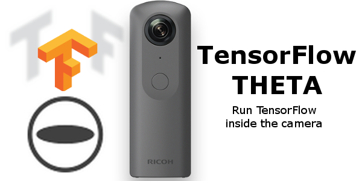
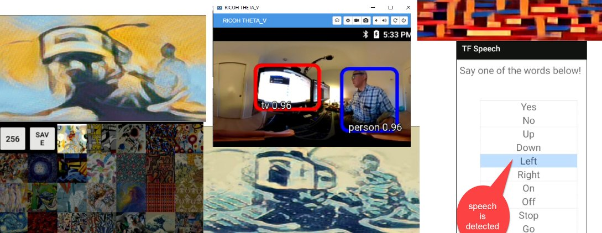
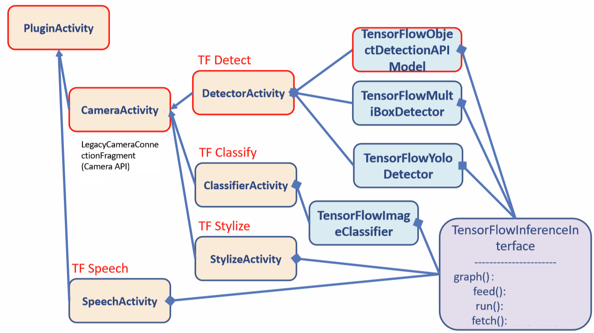
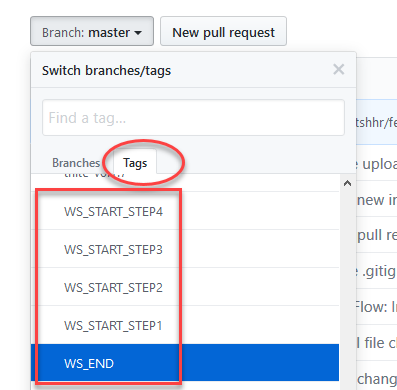

# TensorFlow THETA

-----------------

This is a fork and modification of the original TensorFlow examples for Android. The examples
are modified to work on RICOH THETA cameras running an internal Android OS.

Makoto Shohara is original author of the modifications and workshop examples.

## Quick Start - Run Binary

Follow this guide if you want to install the apk directly into the camera without having to compile the source.

[Running Tensorflow on RICOH THETA V](https://medium.com/theta360-guide/running-tensorflow-on-ricoh-theta-v-e9ca512174cf)

## Screenshots

## Development and Tutorials Specific to RICOH THETA

[HowTo Build Tensorflow Apps for RICOH THETA](https://medium.com/theta360-guide/howto-build-tensorflow-apps-for-ricoh-theta-1b64da06a0bd)

[How to Set Up the THETA V for Tensorflow](https://medium.com/theta360-guide/how-to-set-up-the-theta-v-for-tensorflow-ae117036f637)

Step 1 — Modify code to work with RICOH THETA Camera API

Step 2 — Import RICOH THETA pluginlibrary

Step 3 — Detect objects and shoot picture

Step 4 — Fix PluginLibrary

The steps above correspond to the tags on this GitHub repo. Please select the tag and follow the
comments in the code.

